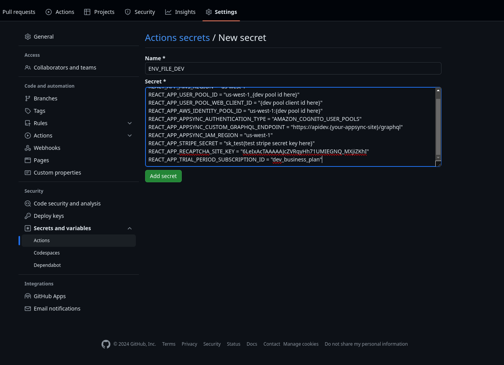

# s6pack - Client App
###### <sup>*For the s6pack Cloud App click [here](https://github.com/bmiles-development/s6pack-cloud).*</sup>
1. Serverless
2. Scalable
3. Secure
4. Software as a
5. Service
6. Starter
* Pack


# SETUP
  
  **This setup uses a deployment strategy by Sharath Vignesh explained [here](https://sharathvignesh.medium.com/ci-cd-deploy-react-app-to-aws-s3-using-github-actions-3f6d77783190).
  1) This setup uses the s6pack-cloud app that must be installed prior to the client setup. Follow the s6pack-cloud instructions [here](https://github.com/bmiles-development/s6pack-cloud). 
  2) Clone this repository and cd into the project folder.
  3) run 
  		```
		npm install
		```
  4) Delete the .git folder 
  5) Create a new project in Github (eg: s6pack-example)
  6) Copy .env.template to .env and replace the dummy values with your own (Use s6pack Cloud app to create these variables or use s6pack Cloud as reference to create your own necessary services). Populate the commented live verson variables as well- they will be used later for copying into git hub secrets for deployment.
		```
		REACT_APP_AWS_REGION = "{your region here eg: us-west-1}"
		```
		User pool ids can be found [here](https://us-west-1.console.aws.amazon.com/cognito/v2/idp/user-pools). Add to the variable in the .env file here:
		```
		REACT_APP_USER_POOL_ID = "us-west-1_{dev pool id here}"
		```
		For the blue and green env variables, use the dataStackLive_user_pool 

		Next populate the User Pool App Client ID. It can be found in the AWS console by clicking the user pool name, then click the ```App Integration``` tab, then at the bottom section under ```App client list``` you will see a list of App clients called something like ```dataStackDev-non_generated_secret_client```. Copy the ```Client ID``` and paste it here:
		```
		REACT_APP_USER_POOL_WEB_CLIENT_ID="{client id here}"
		```
		For the blue and green env variables, use the dataStackLive_user_pool.

		Next, find the Identity Pool Ids [here](https://us-west-1.console.aws.amazon.com/cognito/v2/identity/identity-pools). Populate the vairable below using the dataStackDev-Identity-pool:
		```
		REACT_APP_AWS_IDENTITY_POOL_ID = "us-west-1:{dev pool id here}"
		```
		For the blue and green env variables, use the dataStackLive_identity_pool.
		
		Leave the following as is:
		```
		REACT_APP_APPSYNC_AUTHENTICATION_TYPE = "AMAZON_COGNITO_USER_POOLS"
		```
		Add your Graphql endpoints (defaulted to dev, blue, and green subdomains). They can be found [here](https://us-west-1.console.aws.amazon.com/appsync/home?region=us-west-1#/apis) and click the ```Custom domain names``` in the left column:
		```
		REACT_APP_APPSYNC_CUSTOM_GRAPHQL_ENDPOINT = "https://dev.{your-appsync-site}/graphql"
		```
		IAM Region defaulted to us-west-1
		```
		REACT_APP_APPSYNC_IAM_REGION = "us-west-1"
		```
		For the stripe secret, log into your stripe dashboard API Keys tab [here](https://dashboard.stripe.com/apikeys) and click ```reveal live key``` to get the live secret. paste that into the blue and green live vars. For the dev site, toggle ```Test Mode``` at the top of the page to reveal the test secret key.
		```
		REACT_APP_STRIPE_PUBLISHABLE_KEY="pk_test{test stripe secret key here}"
		```
		Next, log into you Google ReCAPTCHA account [here](https://www.google.com/recaptcha/admin) and select reCAPTCHA v2 checkbox your domain name. Click the ```Settings``` icon. Under the reCAPTCHA keys section click the ```COPY SITE KEY``` button and paste it into the blue and green section. Leave the dev site key as is since it isd the [test key](https://developers.google.com/recaptcha/docs/faq) for local testing.
		```
		REACT_APP_RECAPTCHA_SITE_KEY = "6LeIxAcTAAAAAJcZVRqyHh71UMIEGNQ_MXjiZKhI"
		```
		Leave the default "dev/live_business_plan" for tyhe last env variable:
		```
		REACT_APP_TRIAL_PERIOD_SUBSCRIPTION_ID = "dev_business_plan"
		```

  7) For AWS access key and secret, create a new IAM user [here](https://us-east-1.console.aws.amazon.com/iam/home?region=us-west-1#/users/create) (eg: a User named ClientAppGithubWorkfows) 
  8) Select ```Attach policies directly``` 
  9)  On the "Specify Permissions" page, click ```JSON``` and paste the following limited permissions (replace ```domain_name``` with your domain name):
    	```
		{
			"Version": "2012-10-17",
			"Statement": [
				{
					"Sid": "AccessToGetBucketLocation",
					"Effect": "Allow",
					"Action": [
						"s3:GetBucketLocation"
					],
					"Resource": [
						"arn:aws:s3:::*"
					]
				},
				{
					"Sid": "AccessToWebsiteBuckets",
					"Effect": "Allow",
					"Action": [
						"s3:PutBucketWebsite",
						"s3:PutObject",
						"s3:PutObjectAcl",
						"s3:GetObject",
						"s3:ListBucket",
						"s3:DeleteObject"
					],
					"Resource": [
						"arn:aws:s3:::dev.domain_name.com",
						"arn:aws:s3:::dev.domain_name.com/*",
						"arn:aws:s3:::green.domain_name.com",
						"arn:aws:s3:::green.domain_name.com/*",
						"arn:aws:s3:::blue.domain_name.com",
						"arn:aws:s3:::blue.domain_name.com/*"
					]
				}
			]
		}
		```
  10) Create a Policy Name (eg. ClientAppGithubWorkfowsPolicy) and click ```Create Policy```.
  11) Click your newly created user and select the ```Security Credentials``` tab. Cick the ```Create Access Key``` under the ```Access Keys``` tab. Select ```Other```. For the Decription you can type GithubWorkflows. Click ```Create Access Key```.
  12)Create Github Secrets for Actions. In your github project for the following Workflow variables:
      ```
      ENV_FILE_DEV
      ENV_FILE_GREEN
      ENV_FILE_BLUE
      ```
      Each of these Github Secrets need to contain all of the variables and values found in the .env file you've just edited. Keep all the vairables safe somewhere on your local computer because once saved in Github Secrets you will not be able to view them again. See screenshot for reference: 
	   
  13) Create seperate Github Secrets for each of the variables below. These are used in the Github Workflow templates which can be found in the .github/workflows folder:
	  ```
      AWS_BUCKET_NAME_DEV="dev.{your-domain-name}"
	  AWS_BUCKET_NAME_BLUE="blue.{your-domain-name}"
      AWS_BUCKET_NAME_GREEN="green.{your-domain-name}"
      AWS_ACCESS_KEY_ID="{access key from step 11}"
      AWS_SECRET_ACCESS_KEY="{secret access key from step 11}"
      AWS_REGION="{default us-west-1}
	  ```
      
  14) Run:
		``` 
		npm build 
		```
  15) Create three new branches after creating the main branch: 
  		```
		git checkout -b dev
		git checkout -b green
		git checkout -b blue
  		```
  16) Push the three branches: dev, blue, and green live.
		```
		git push -u origin dev
		git push -u origin blue
		git push -u origin green
		```
  17) After a few minutes wating for the github actions (see them running under the github.com ```Actions``` tab) you should be able to navigate to your live website.
  18) running ```npm start``` will launch the local copy, but it uses the variables stored in the env file, so it is possible to switch between the dev, blue, and green stacks locally by commenting/uncommenting the block of variables (the live dev stack is the default)


Special thanks to Codetheme's [Mantis](https://github.com/codedthemes/mantis-free-react-admin-template) for the slick dashboard template.

[](https://opensource.org/licenses/MIT)
[](https://github.com/bmiles-development/s6pack-client/blob/main/LICENSE)


